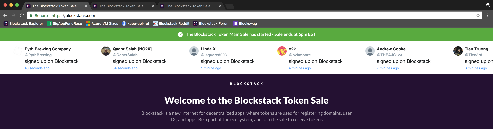
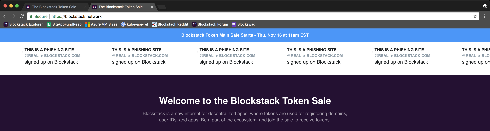
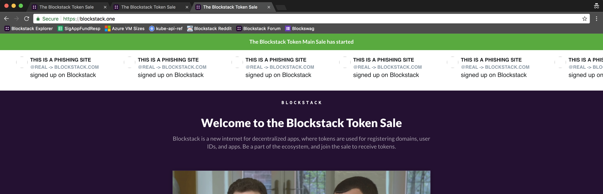

# Blockstack Twitter

### A Twitter caching microservice with anti-phishing measures

This is a service that takes a query string and caches the 20 most recent tweets (ex RTs) from that query for easy access from a front end.

There is also a sample systemd unit file for easy and safe deployment!

A sample config file (`~/.blockstack-twitter.yaml`)

```yaml
search:         "Verifying my Blockstack"
consumerKey:    "yourTwitterConsumerKey"
consumerSecret: "yourTwitterConsumerSecret"
accessToken:    "yourTwitterAccessToken"
accessSecret:   "yourTwitterAccessSecret"
port:           ":8080"
```

### Fighting scammers on the Tokensale Site

This API was created to provide a live twitter feed for our tokensale site blockstack.com to show users registering their Blockstack identities in real time:



The day of the tokensale we were notified that there were some scam sites that had cloned `blockstack.com` and added their own payment flows into the backend. If you follow the crypto space you know this is pretty par for the course. We quickly added an nginx rule to block the scam sites:

```nginx
if ($http_referer ~* scam\.site) {
  return 444;
}
```

Then we brainstormed ways to direct users away from these sites. Since they were using our API and directly inputing text from the JSON and displaying it to users (this was a clone of our site) we could just send them some different JSON! I quickly put together a endpoint to handle the malicious sites: `/scam` and then modified the nginx rule to direct the scam sites to that endpoint:

```nginx
if ($http_referer ~* scam\.site) {
  rewrite ^(.*)$ /scam;
}
```

Below are some photos for your enjoyment:




